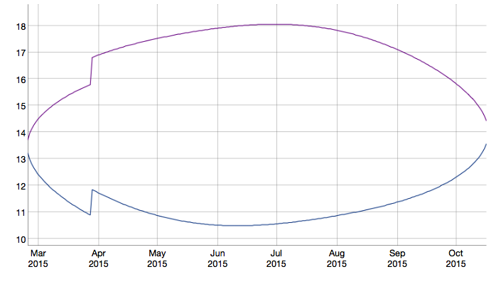

---
title       : Sun height calculator
subtitle    : a Shiny app
author      : Michele Coleman
job         : May 23, 2015
framework   : io2012        # {io2012, html5slides, shower, dzslides, ...}
highlighter : highlight.js  # {highlight.js, prettify, highlight}
hitheme     : tomorrow      # 
widgets     : []            # {mathjax, quiz, bootstrap}
mode        : selfcontained # {standalone, draft}
knit        : slidify::knit2slides

--- bg:#FEFF99
<style type="text/css">
.title-slide {
  background-color: #FFF44F; /* #EDE0CF; ; #CA9F9D*/
}

.title-slide hgroup > h1, 
.title-slide hgroup > h2 {
  color: #222222 ;  /* ; #EF5150*/
}

slide:not(.segue) h2,h3{color: #222222}

</style>


## Do I need a hat?

I know if I go out in the sun in July before about 5 PM, I'll burn, but I'm not sure about October. Say today is October 5, it's 11 AM, and I'm in Baltimore. Do I need a hat? Let's ask R.

```{r}
library(insol)
july1_17 = ISOdate(2015,7,1,17,0,0,tz='US/Eastern')
oct5_11 = ISOdate(2015,10,5,11,0,0,tz='US/Eastern')
mytimes = rbind(july1_17,oct5_11)
sunseries <- sunpos(sunvector(JD(mytimes),latitude=39,longitude=-77,0))
result = as.data.frame(cbind(mytimes,90-sunseries[,2]))
colnames(result) = c('time','sun_angle')
result$time <- as.POSIXct(result$time, tz='US/Eastern', origin = '1970-01-01')
result
```
Answer: I should be cautious if the sun is above 39°. Right now the sun is approaching 39° but still rising (since it's before midday). I should wear a hat!

--- bg:#FEFF99

## Solving for the entire year
I'd like to know for the entire year what hours the sun is above 40°. Also sometimes I travel. The sun_calc app will tell me the local time of day that the sun passes through a given angle, at a given location, throughout the year. Here's the 40° sun angle times in Madrid:



--- bg:#FEFF99

### Usage tips
- Want more sun exposure so you can increase your vitamin D production? Look for when the sun is higher than 50°.
- Set the angle to 0° for an estimate of sunrise and sunset time. The times shown would be correct if the earth did not have an atmosphere! But because air bends light you actually see the sun when it's below 0°. If you need more precise times try http://www.gaisma.com/en/ . 
- For sunburn prevention you must choose your own value, based on your skin tone and personal susceptibility. Start with what times of day you feel safe in summer at your latitude to determine what angle is safe for you. Then you can extrapolate to other times of year and other places.  

### Known glitches in current version:
Straight lines connect NULL days in Southern winter &#9728; Tooltime reports dates as UTC but they are local time &#9728; Tooltip reports "decimal" time, e.g. "19.75" would mean clock time "19:45".

--- bg:#FEFF99
## Ideas for improvements
- Try different graphics package. The current one displays time in decimal hours (4.75 instead of 4:45), draws connecting lines across dates in (Southern hemisphere) winters that have no crossings and should be blank, and incorrectly states that the dates are UTC when they are in fact local time
- More intelligent selection of axis limits, for consistency as selected input changes
- For Northern hemisphere, force plot to be for entire year, even if there are no crossings of that angle in winter
- Add title to graph, showing location & angle chosen
- Allow user to input any latitude and longitude desired. Even better if the app could automatically figure out their time zone.
- Really awesome: Allow user to select a location by clicking on a map. Again ideally the app would figure out their time zone.


